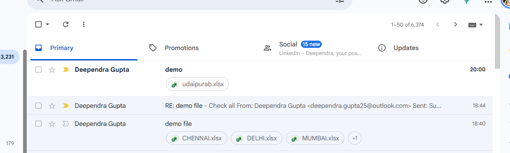

# Automated Sales Data Consolidation — Gmail to Power Query

## 📌 Project Overview

This project demonstrates an automated workflow for consolidating
sales Excel files received through Gmail using Google Apps Script
and Microsoft Power Query.

The objective is to reduce repetitive manual downloading, copying,
and appending of Excel sales files received through email.

## 🔄 Workflow

Gmail
↓
Google Apps Script
↓
Email Attachments
↓
Power Query
↓
Data Transformation
↓
Append Multiple Excel Files
↓
Final Sales Dataset

## 🛠️ Tools & Technologies

- Microsoft Excel
- Power Query
- Gmail
- Google Apps Script
- JavaScript
- JSON

## ⚙️ How It Works

1. Sales Excel files are received through Gmail.
2. Google Apps Script retrieves the email attachments.
3. The script exposes the attachment information through a web endpoint.
4. Power Query connects to the source.
5. The incoming files are extracted and transformed.
6. Multiple Excel files are appended into a single dataset.
7. The final dataset can be refreshed to retrieve updated data.

## 📊 Project Result

The final Power Query output consolidates sales records from multiple
Excel files into a single structured dataset.

## 📷 Screenshots

### Gmail Input

### Power Query Transformation

### Final Output

### Final Output — Additional View

## 📁 Project Files

| File | Description |
|---|---|
| `append data from gmail automation.xlsx` | Excel workbook containing the Power Query workflow |
| `code.gs` | Google Apps Script used for Gmail attachment retrieval |
| `gmail_to_power_query_sales_automation/` | Project screenshots |

## 🎯 Business Use Case

This workflow can be useful when sales or operational reports are
regularly received through email and need to be consolidated into a
single reporting dataset.

Instead of manually downloading and combining files, the process can
be refreshed through Power Query.

## 📚 Learning Outcomes

This project provided practical experience with:

- Power Query data ingestion
- External data sources
- JSON data
- Binary Excel files
- Excel workbook extraction
- Appending multiple files
- Data transformation
- Google Apps Script
- Gmail automation
- Refreshable reporting workflows
